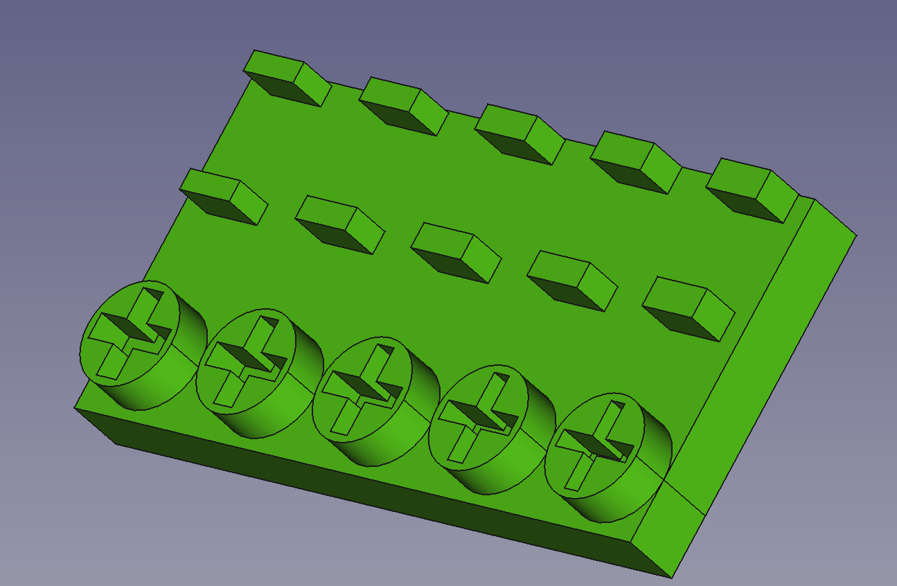

# 3D Print Keycap Testing Model

This model using FreeCAD 0.19

## Testing Model

- Cherry MX Compatible
  - 1.2 mm
  - 1.1 mm
  - 1.0 mm
  - 0.9 mm
  - 0.8 mm
- Kailh Choc V1
  - 1.0 mm
  - 1.1 mm
  - 1.2 mm
  - 1.3 mm
  - 1.4 mm

## Result

### DMM Make

https://make.dmm.com/item/1311056/

- MDF
